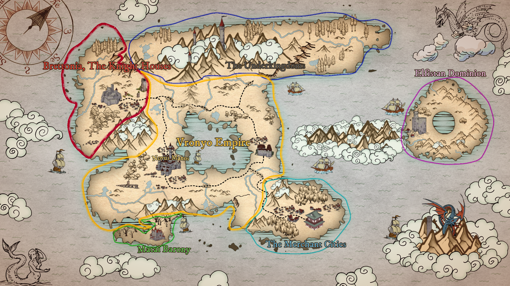

# Intro
It is the 1st Millennium.
For 10 centuries, the emperors of Vronyo have balanced their power and interest to maintain the peace upon the continent. They are the masters of humanity by will of the gods, and they are the masters of the Vronyo Empire by the clandestine might of their inexhaustible agents. They are 'immortal', by the undisputed line of succession, so that title of "Emperor" may never truly die.

Yet despite their eternal vigilance, growing tensions and great powers scheme to impart their own will upon the world. The Knight Houses, once loyal vassals of the Empire, have refused to ride out in the Emperor's name for 50 years. The great Baron lies upon a literal mountain of gold, with rumors swirling of a world changing level of wealth and an apathy to the people who would benefit from it. Amidst these tensions, the Elfistan Dominion, once a pinnacle of influence, has turned increasingly isolationist. Driven by dreams of past grandeur and mastery over humanity, the Dominion retreats from the world, fostering a sense of unease and uncertainty among nations.

A prophet foresees a future of mighty armies and warriors giving battle across the world in the name of Empire and Dominion. Civilizations fall and cultures vanish. The Vronyo Empire lies in ruins, along with the rest of the world in arcane fire. The wounds are salted, never to heal.
The prophet runs to tell his vision to his lord, and is executed for heresy.

The golden age of prosperity and peace is almost over. All the future holds is strife and conflict, the infinitesimal possibility to avert this all to continue the golden age of peace, and the mad laughter of malicious gods.

# Player Notes
- The party is at the capital city of Vronyo. It is a national holiday, for it is the Emperor's birthday. 
- The Emperor will throw a party in the evening that is open to the public.
	- Anyone may personally give the emperor a gift and petition a request.
	- The emperor will grant the wish to the person who gives the gift he likes the most.
- Players will start off at level 4
- No restrictions on character races or classes
- I'm aiming for these sessions to be of intrigue and secrecy, but I will try my best to be flexible to everyone's play style and creative solutions. First time dm'ing so I apologize in advance if I get some stuff wrong.

# Nations and Factions
## Vronyo Empire
Emperor Reman XI
An empire of many races and many cultures, all lead by the unbroken line of the Emperor. A line that spans back a thousand years, where the first emperor was born a slave to the Elven overlords.
While there is no state religion or endorsement or persecution of any beliefs, generations past have created in secret the Imperial Cult, where the Emperor is not man, but a divine god on the world.
Golden temples and marble palaces dots the Vronyo Empire, a temperate breeze blows across and the fresh air fills the lungs.
## Brettonia, The Knight Houses
Monarch Yovarius Khan
A secluded and cloistered society, the Knight Houses are extremely wary of outsiders. While technically a vassal state of the Vronyo Empire, they have not done their vassal duties for 50 years, a cause of anxiety for many. Inquiries unto why are almost impossible, for no foreigners are given entry into the court life of intrigues and politicking in the Knight Houses. 
Eschewing worship of the gods and divinity, the lords of the knight houses practice a sort of ancestor worships. An obsession with honor and duty to their king and ancestors

## Elfistan Dominion
Minister Yvrainne Aelvani 
The enchanting realm of the Elfistan Dominion, where elegance and wisdom intertwine in a tapestry of ancient grace. Nestled within lush forests and crystalline landscapes, the Dominion offers a haven of serenity for those who yearn for an escape from the mainland. Fairies, halflings, and mainlanders call this island home with the elves.
The country is led by a council of elves, with lifespans so long they might as well be immortal, for no elf has yet to die of old age in Elfistan.
Many look upon Elfistan with wonder and awe, they see it as the lone pinnacle of paradise upon the world. For too many generations have passed for the many to remember the Elfistan atrocities.
## Matai Barony
Professor Baron
A small barony, only allowed independence for the vast wealth they pay in taxes to the Empire. Their fields are barren, their industry miniscule, but their colleges stands above all. The sun never shines upon the Matai Barony, yet aspiring spellcasters apply from around the world apply to set their feet upon the hallowed halls of Fervorborne Bureau of Incantations.
But rumors spread of profane research into heretical magic spreads, and the Baron's unexplainable wealth does nothing to ease the rumors.

## The Underkingdoms
A region so inhospitably cold that the dwarven and drow have elected to build their settlements deep underground. They have dodged the empires eyes, but they cannot dodge each other's arrows.

## The Merchant Cities
A cosmopolitan grouping of city states with only superficial similarities between each other. Each city state different in culture from the other. All united under the Merchant Prince, and shared greed. The only thing that stops the cities from open warfare is the common belief that cooperation is better for business.

# The Lawful Gods of the World
## Talar
A god of law and order, justice and righteousness. His hammer strikes the wicked and is a gavel for the divine court of who enters the planes of fire or the celestial plane. Favored among humans

## Nike 
The goddes of war and magic, honor and courage. Her right spear skewers her foes and her left spear casts arcane spells from afar. Favored among elves

## The Omnissiah
A god of machines and logic. Many go their entire lives without ever speaking with an adherent of this niche god.

# The Chaotic Gods of the World
They do not exist, nor have they ever existed.